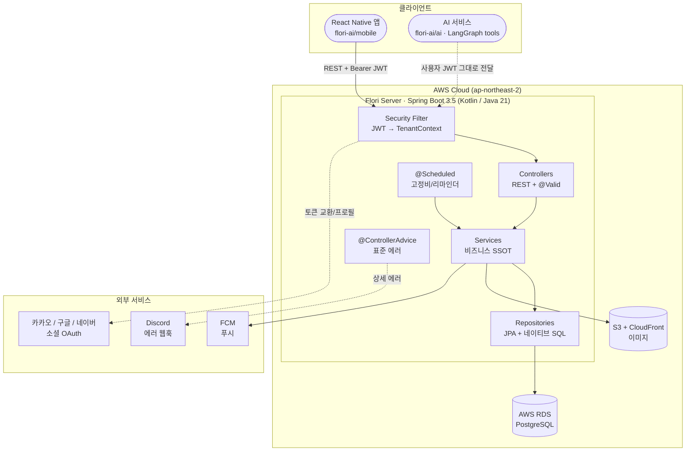
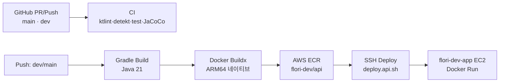

# Flori Server

> 꽃집 어드민(Flori)의 모바일/웹 백엔드 — Spring Boot(Kotlin) REST API


이 repo는 Flori 시스템 전체의 **단일 진실 공급원(Source of Truth)** 이다. 매출·지출·고객·예약·갤러리·통계를 독립 꽃집들에게 제공하며, 자체 AWS 인프라 위에서 모바일이 호출 가능한 REST API로 동작한다. 멀티테넌시와 구독 게이팅이 모두 여기서 강제된다 — 모든 쿼리는 호출자의 JWT에서 추출한 `user_id`로 격리되고, DB RLS가 없으므로 애플리케이션이 유일한 방어선이다.

---

## 목차

- [Quick Start](#quick-start)
- [환경 설정](#환경-설정)
- [아키텍처](#아키텍처)
- [프로젝트 구조](#프로젝트-구조)
- [도메인](#도메인)
- [보안 모델](#보안-모델)
- [CI/CD](#cicd)

---

## Quick Start

### 필수 요구사항

- Java 21+
- Gradle 8.x+ (Gradle Wrapper 포함)
- (실행 시) Docker — 로컬 PostgreSQL `flori-pg`

### 실행

```bash
# 1. 클론
git clone <repository-url>
cd server

# 2. 빌드 + 검증 (로컬 DB 불필요 — 테스트는 Zonky 임베디드 PostgreSQL 사용)
./gradlew build test     # ktlint + detekt + 전체 테스트 + JaCoCo 80% 게이트

# 3. 로컬 실행 (기본 프로필: local)
./gradlew bootRun

# 4. API 문서 확인
open http://localhost:8080/swagger-ui.html
```

> 부팅 시 Flyway가 스키마를 적용하고, 헬스체크는 `GET /health`. 환경변수 값은 팀 리드에게 문의하세요.

### 자주 쓰는 Gradle 태스크

| 태스크 | 설명 |
|--------|------|
| `./gradlew build test` | ktlint + detekt + 전체 테스트 + JaCoCo line 80% 게이트 |
| `./gradlew ktlintFormat` | 코드 자동 포맷 |
| `./gradlew openapi3` | RestDocs 테스트에서 OpenAPI 스펙 재생성 (→ `static/docs/open-api-3.0.1.json`) |
| `./gradlew bootRun` | 로컬 실행 (프로필: local) |

---

## 환경 설정

### 프로필

| 프로필 | DB | 용도 |
|--------|-----|------|
| `local` | Docker `flori-pg` (bootRun) / Zonky 임베디드 (test) | 로컬 개발·테스트 |
| `prod` | AWS RDS PostgreSQL | 운영 서버 |

### 환경변수

모든 시크릿/설정은 환경변수로 주입한다(`application.yml`은 `${ENV}` 참조만). 미설정 값은 local에서 graceful하게 fallback한다.

| 변수 | 설명 | 미설정 시 |
|------|------|-----------|
| `DB_URL` / `DB_USER` / `DB_PASSWORD` | PostgreSQL 연결 | local 기본값 |
| `JWT_SECRET` | JWT 서명키 (운영 필수, ≥32 bytes) | local 전용 기본값 ⚠️ 비-local 프로필은 부팅 거부 |
| `JWT_ACCESS_TTL` / `JWT_REFRESH_TTL` | 토큰 만료(초) | 900 / 1209600 |
| `AWS_REGION` / `S3_BUCKET` / `CLOUDFRONT_DOMAIN` | S3 presigned 업로드 | 미발급(presign 시 에러) |
| `FCM_ENABLED` / `FCM_CREDENTIALS` | FCM 푸시 | 로깅 fallback(no-op) |
| `DISCORD_WEBHOOK_URL` | 운영 에러 알림 | 콘솔 로깅 |
| `INTERNAL_API_KEY` | 내부 ingest API 인증 | 내부 API 차단 |
| `CORS_ALLOWED_ORIGINS` | 앱/웹 origin 화이트리스트(쉼표 구분) | localhost:3000,8081 |
| `SPRING_PROFILES_ACTIVE` | 활성 프로필 | `local` |

### 개발 도구

| 도구 | URL | 설명 |
|------|-----|------|
| Swagger UI | `http://localhost:8080/swagger-ui.html` | API 계약(테스트로 생성된 스펙) & 테스트 |
| Health | `http://localhost:8080/health` | 헬스체크 |

> **운영 체크리스트**: 강한 `JWT_SECRET` 설정(비-local 프로필은 미설정 시 부팅 실패), Swagger 비활성화(`springdoc.swagger-ui.enabled=false`), rate limiting 검토.

---

## 아키텍처



> 상세 아키텍처 및 기술 선정 이유는 [`docs/ARCHITECTURE.md`](docs/ARCHITECTURE.md) 참조

### 책임 분리

| 레이어 | 책임 |
|--------|------|
| **flori-ai/server (이 프로젝트)** | Spring REST API. 데이터·멀티테넌시·구독 게이팅의 SSOT, `user_id` 격리. AI 도구가 감싸는 검증된 표면 |
| flori-ai/ai | AI 오케스트레이션 — tool-call 루프, 비전 OCR, 음성 세션, 확인 카드. DB 접근 없음, 사용자 JWT로 이 API 호출 |
| flori-ai/mobile | React Native 앱. JWT 발급(로그인 UI), 확인 카드 UI, 음성 I/O |
| flori-ai/web | 동일 꽃집용 Next.js PWA 어드민 |

---

## 프로젝트 구조

```
src/main/kotlin/kr/ai/flori/
├── auth/                  # 소셜 로그인/가입, JWT 발급·refresh rotation, registerToken
├── user/                  # 사용자 / 내 정보(/me)
├── sales/                 # 매출 기록 · 미수 처리
├── expenses/              # 지출 + 고정비 자동 생성(@Scheduled)
├── customers/             # 고객 (find-or-create, 실시간 통계)
├── reservations/          # 예약 (판매 전환, 픽업)
├── calendar/              # 캘린더 (리마인더 푸시)
├── photos/                # 갤러리 (presigned 업로드) · 태그
├── insights/              # 트렌드/공유 조회 · 스크랩 · 내부 ingest
├── settings/              # 카드사 · 매출/지출 설정 · 하단바 · 푸시 구독
├── subscriptions/         # 구독 + 게이팅 · 구독 보안
├── dashboard/             # 오늘/월 집계 · 네이티브 SQL 통계
└── common/                # 횡단 관심사 (security, error, tenant, storage, push, config, ...)
```

### 도메인별 레이어 패턴

```
{domain}/
├── controller/         # REST 엔드포인트 + @Valid
├── service/            # 비즈니스 로직 (계산 SSOT)
├── repository/         # JPA + 네이티브 SQL
├── entity/             # JPA 엔티티
├── dto/                # 요청/응답 DTO (엔티티 노출 금지)
└── error/              # 도메인 에러 코드
```

### 주요 기술 스택

| 영역 | 라이브러리 |
|------|-----------|
| 프레임워크 | Spring Boot 3.5 (Kotlin, Java 21 toolchain) |
| ORM | Spring Data JPA + Hibernate (jsonb/배열은 hypersistence-utils) |
| 마이그레이션 | Flyway (SQL DDL) + `ddl-auto: validate` |
| 인증 | JJWT 0.12 (자체 JWT) + 소셜 OAuth (카카오·구글·네이버) |
| 스토리지 | AWS S3 + CloudFront (presigned PUT) |
| 푸시 | FCM (Firebase Admin SDK) |
| API 문서 | Spring REST Docs + ePages restdocs-api-spec → OpenAPI 3 |
| 품질 | ktlint · detekt · JUnit(Zonky embedded PostgreSQL) · JaCoCo line 80% |

---

## 도메인

| 도메인 | 책임 |
|--------|------|
| **auth** | 소셜 로그인/가입, JWT 발급·refresh rotation, registerToken, `/me` |
| **sales** | 매출 기록 · 미수(unpaid) 처리 |
| **expenses** | 지출 + 고정비 자동 생성(`@Scheduled`) |
| **customers** | 고객 (find-or-create, 실시간 통계) |
| **reservations / calendar** | 예약(판매 전환, 픽업) · 캘린더(리마인더 푸시) |
| **photos** | 갤러리(presigned 업로드) · 태그 |
| **insights** | 트렌드/공유 조회 · 스크랩 · 내부 ingest |
| **settings** | 카드사 · 매출/지출 설정 · 하단바 · 푸시 구독 |
| **subscriptions** | 구독 + 게이팅 |
| **dashboard** | 오늘/월 집계 · 네이티브 SQL 통계 |

---

## 보안 모델

- **멀티테넌시 = 보안 1순위.** DB RLS가 없으므로 애플리케이션이 유일한 방어선 — 모든 쿼리는 JWT에서 파생한 `TenantContext.currentUserId()`로 격리한다. `user_id` 필터 누락은 곧 데이터 유출.
- **자체 JWT** — 짧은 access 토큰(HS256) + DB에 해시 저장되는 opaque refresh 토큰(rotation). **소셜 전용**(카카오·구글·네이버 OAuth) — 비밀번호 없음. 서명키는 환경변수에서만.
- **서버가 계산 SSOT** — 지출총액·고정비 생성은 서버에서 계산하고, 클라이언트는 표시만 한다.
- 경계 입력 검증(Jakarta Bean Validation), 파라미터 바인딩 쿼리(네이티브 SQL 포함), CORS origin 화이트리스트, 일반 에러 응답(상세는 Discord에만).

> 전체 체크리스트는 [`docs/PATTERNS.md`](docs/PATTERNS.md)와 [`CLAUDE.md`](CLAUDE.md) 참조.

---

## CI/CD

### 파이프라인 흐름



### 워크플로우

| 파일 | 트리거 | 설명 |
|------|--------|------|
| `ci.yml` | PR / push (`main`, `dev`) | 빌드 + 검증(ktlint·detekt·test·JaCoCo, Gradle Wrapper 무결성 검증) |
| `deploy-api-dev.yml` | push (`dev`, `main`) | ARM64 네이티브 빌드 → ECR(`flori-dev/api`) → SSH `deploy.api.sh` |

> 인프라(RDS / S3 / CloudFront / ECR / 배포)는 별도로 프로비저닝되며 이 repo 범위 밖이다.

---

## 참고 문서

| 문서 | 설명 |
|------|------|
| [docs/ARCHITECTURE.md](docs/ARCHITECTURE.md) | 아키텍처 & 기술 선정 이유 (Mermaid) |
| [docs/DATABASE.md](docs/DATABASE.md) | DB 스키마 명세 (SSOT) |
| [docs/DESIGN.md](docs/DESIGN.md) | 설계 SSOT, 배경 & 범위 |
| [docs/ERROR_CODES.md](docs/ERROR_CODES.md) | 에러 코드 체계 |
| [docs/KOTLIN.md](docs/KOTLIN.md) | Kotlin/Spring 관용구 |
| [docs/PATTERNS.md](docs/PATTERNS.md) | 레이어 패턴, 멀티테넌시, 신규 도메인 레시피 |
| [docs/conventions/](docs/conventions/README.md) | 컨벤션 ADR (결정과 근거) |
| [CLAUDE.md](CLAUDE.md) | 작업 가이드, 스택, 보안 체크리스트 |
