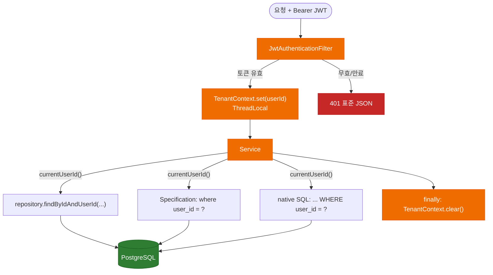
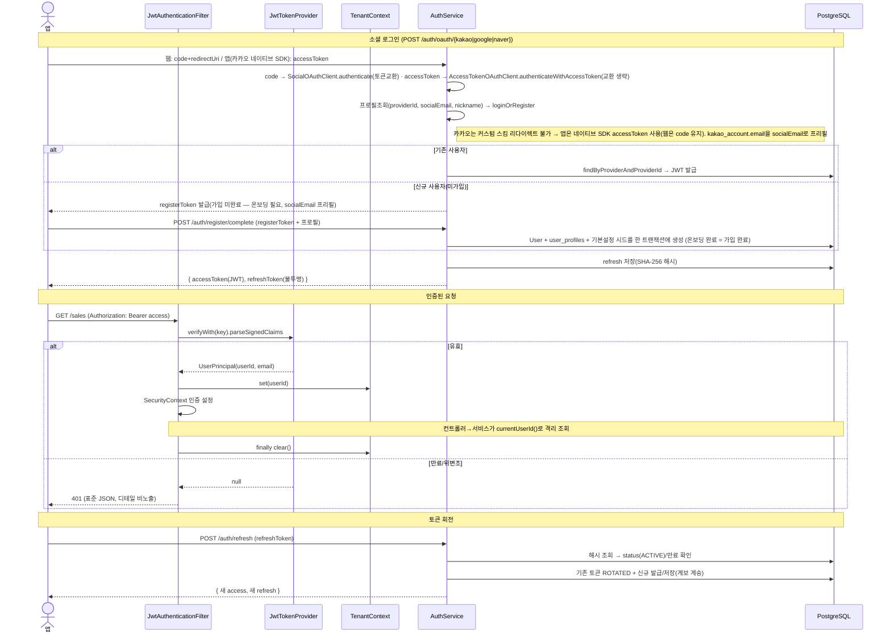
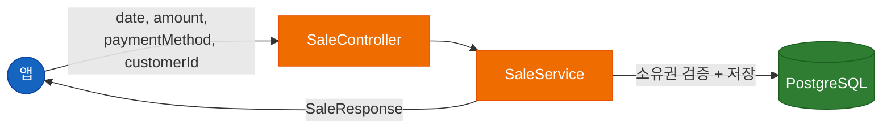
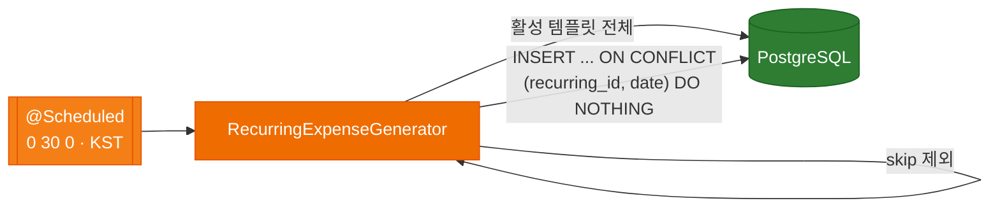
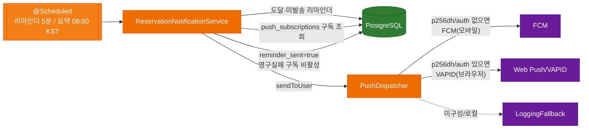
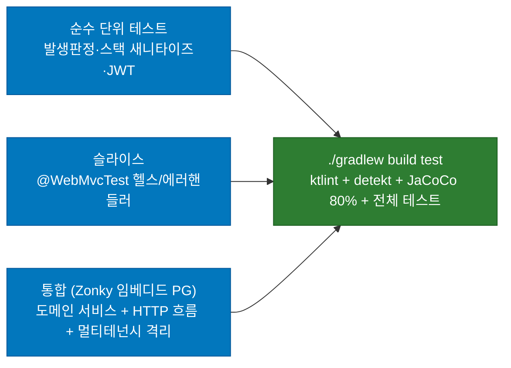
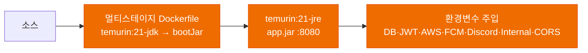

# Flori API — 아키텍처 & 기술 선정 이유

> 최종 업데이트: 2026-05-29

이 문서는 Flori(꽃집 어드민) **모바일 앱 백엔드 API**의 기술 스택과 아키텍처를 설명한다. 단순히 "무엇을 쓰는가"가 아니라 **"왜 이것을 골랐는가"**에 초점을 맞춘다. 모든 선택에는 *기존 Next.js+Supabase 웹앱의 비즈니스 로직을 네이티브 앱이 호출 가능한 REST API로 재구현하고, 자체 AWS 인프라 위에 올린다*는 도메인 맥락이 반영되어 있다.

설계 SSOT는 `docs/DESIGN.md`, 진행 상태는 `ROADMAP.md`, 세션 인수인계는 `HANDOFF.md`를 참조한다.

---

## 아키텍처 개요

```mermaid
flowchart TB
    subgraph Clients["클라이언트"]
        App([React Native 앱<br/>flori-ai/mobile])
        Collector([수집 워커<br/>트렌드/인스타])
    end

    subgraph AWS["AWS Cloud (ap-northeast-2)"]
        subgraph Server["Flori API · Spring Boot 3.5 (Kotlin / Java 21)"]
            Sec[Security Filter<br/>JWT → TenantContext]
            Ctrl[Controllers<br/>REST + @Valid]
            Svc[Services<br/>비즈니스 SSOT]
            Repo[Repositories<br/>JPA + 네이티브 SQL]
            Sched[@Scheduled<br/>Cron 대체]
            Adv[@ControllerAdvice<br/>표준 에러]
        end
        RDS[(AWS RDS<br/>PostgreSQL)]
        S3[(S3 + CloudFront<br/>이미지)]
    end

    subgraph External["외부 서비스"]
        FCM[FCM<br/>모바일 푸시]
        VAPID[Web Push/VAPID<br/>브라우저(PWA) 푸시]
        Discord[Discord<br/>에러·가입·인증 웹훅]
        KakaoAuth[kauth.kakao.com<br/>카카오 토큰교환]
        KakaoApi[kapi.kakao.com<br/>카카오 프로필조회]
    end

    App -->|"REST + Bearer JWT"| Sec
    Collector -->|"/internal · Bearer 키"| Sec
    Sec --> Ctrl --> Svc --> Repo --> RDS
    Svc -->|"presigned PUT/GET"| S3
    App -.->|"직접 업로드"| S3
    Sched --> Svc
    Svc -->|"PushDispatcher<br/>(FCM or VAPID)"| FCM
    Svc -->|"PushDispatcher<br/>(p256dh/auth 있으면)"| VAPID
    Adv -.->|"예기치 못한 오류"| Discord
    Svc -.->|"가입·인증 신청<br/>(AFTER_COMMIT @Async)"| Discord
    Svc -->|"인증코드 교환"| KakaoAuth
    Svc -->|"프로필 조회"| KakaoApi

    classDef client fill:#1565c0,color:#fff,stroke:#0d47a1
    classDef server fill:#ef6c00,color:#fff,stroke:#e65100
    classDef store fill:#2e7d32,color:#fff,stroke:#1b5e20
    classDef ext fill:#6a1b9a,color:#fff,stroke:#4a148c

    class App,Collector client
    class Sec,Ctrl,Svc,Repo,Sched,Adv server
    class RDS,S3 store
    class FCM,VAPID,Discord,KakaoAuth,KakaoApi ext
```

핵심 원칙: **앱은 표시만 하고, 계산·검증·격리는 서버가 책임진다.** 지출총액 등은 서버가 SSOT로 계산해 응답하고, 멀티테넌시(사용자별 데이터 격리)는 RLS 없이 애플리케이션이 유일한 방어선으로 강제한다. 기존 웹앱은 당분간 Supabase 위에서 그대로 동작하며, 이 백엔드는 독립 인프라로 분리 운영한다.

---

## 레이어 / 패키지 구조

```mermaid
flowchart LR
    subgraph Cross["common/ · 횡단 관심사"]
        direction TB
        CSec[security<br/>JWT·필터·SecurityConfig]
        CTen[tenant<br/>TenantContext]
        CErr[error<br/>AppException·Discord]
        CSto[storage<br/>S3 presign/delete]
        CPush[push<br/>FCM + Web Push/VAPID<br/>PushDispatcher 라우팅]
        CCfg[config<br/>CORS·Async·Schedule·WebConfig]
        CLog[log<br/>LoggingInterceptor·TraceIdFilter·logback]
        CReq[request<br/>ClientContext·ClientContextFilter]
        CNoti[notification/discord<br/>DiscordNotifier·DiscordChannel]
    end

    subgraph Domain["도메인 패키지 (kr.ai.flori.*)"]
        direction TB
        D[controller → service → repository<br/>DTO 경계]
    end

    Cross --> Domain

    classDef common fill:#0277bd,color:#fff,stroke:#01579b
    classDef dom fill:#ef6c00,color:#fff,stroke:#e65100
    class CSec,CTen,CErr,CSto,CPush,CCfg,CLog,CReq,CNoti common
    class D dom
```



레이어 규칙(HARD): **`controller → service → repository`**. 엔티티는 서비스 안에서만 다루고 컨트롤러는 DTO만 노출한다(요청/응답 DTO 분리). 도메인을 추가할 때 기존 코드 수정 없이 패키지만 추가하면 되도록 설계했다.

| 도메인 패키지 | 책임 |
|---|---|
| `auth` | 회원가입(기본 설정 시드)·로그인·**카카오 소셜 로그인**·refresh 회전·로그아웃·`/me` |
| `sales` | 매출 CRUD·무한스크롤·필터·**요약(GET /sales/summary)**·미수·**서버 입금계산** |
| `expenses` | 지출 + 고정비(this/all 분기·**@Scheduled 자동생성**) |
| `customers` | 고객 CRUD·findOrCreate·**실시간 구매통계** |
| `reservations` / `calendar` | 예약(매출 전환·픽업)·캘린더 이벤트·**리마인더/요약 푸시** |
| `photos` | 사진카드(presigned 업로드·삭제·**다운로드**)·태그 |
| `insights` | 트렌드/인스타 공유 읽기(**카테고리별 개수·최근 수집 시각**)·스크랩·**내부 수집 API** |
| `community` | 단일 커뮤니티 게시판(게시글·댓글·대댓글·좋아요·비밀글·soft delete)·이미지 업로드. **`@RequiresBusinessVerified` 게이팅 적용** |
| `verification` | 사업자 인증 신청·상태 조회(PENDING/APPROVED/REJECTED/NONE)·presigned 업로드·게이팅(`@RequiresBusinessVerified`) |
| `settings` | 매출/지출 설정·하단바·사용자 설정·푸시 구독·**테스트 발송** |
| `dashboard` | 오늘/월 집계·**네이티브 SQL 통계** |

---

## 기술 스택 선정 이유

### Kotlin + Spring Boot 3.5 (Java 21)

**왜 이 조합인가:**

원본 웹의 비즈니스 규칙(고정비 반복, 미수 처리 등)을 **타입 안전하게** 재구현하면서, 엔터프라이즈급 보안·트랜잭션·스케줄링을 표준 방식으로 확보해야 한다.

1. **Kotlin null-safety + 데이터 클래스**: 금액/날짜/상태 등 도메인 값의 null 경계를 컴파일 타임에 강제한다. DTO·엔티티가 간결하다.
2. **Spring Security / Data JPA / @Scheduled / @ControllerAdvice**: 인증·데이터 접근·Cron 대체·표준 에러 응답을 한 프레임워크로 일관되게 처리한다.
3. **Java 21 toolchain**: 최신 LTS, 가상 스레드 등 향후 확장 여지.

| 탈락 후보 | 이유 |
|---|---|
| Node.js(NestJS) | 기존 웹이 이미 TS/Next. 백엔드는 JVM의 트랜잭션·스케줄·보안 생태계가 더 견고 |
| Java(순수) | Kotlin의 null-safety·간결함이 도메인 로직 이식에 유리 |
| Ktor | 풀스택 기능(Security/JPA/Validation 통합)은 Spring이 압도적 |

---

### Spring Data JPA + 네이티브 SQL 혼용

**왜 둘 다 쓰는가:**

도메인 CRUD는 객체지향으로, 통계 집계는 SQL로 다루는 게 각각 자연스럽다.

1. **JPA + Hibernate**: 엔티티 CRUD·연관관계·Dirty Checking. `ddl-auto=validate`로 **엔티티-스키마 정합성을 부팅 시 강제**(스키마 SSOT는 `docs/sql` DDL 직접 관리).
2. **네이티브 SQL(JdbcTemplate)**: 대시보드/통계의 `GROUP BY`·`FILTER`·`EXISTS`, 고객 실시간 구매통계, 고정비 멱등 INSERT(`ON CONFLICT`). 모든 네이티브 쿼리는 `user_id` 파라미터 바인딩으로 격리·인젝션을 방지한다.

**jsonb/배열 매핑**: Hibernate 6 네이티브 `@JdbcTypeCode(SqlTypes.ARRAY / JSON)`을 우선 사용한다(`days_of_week INT[]`, `yearly_dates jsonb`, `photos jsonb`). 단, `List<String>`을 ARRAY·JSON 양쪽으로 매핑하면 Hibernate 전역 타입 해석이 충돌하므로, **text[] 배열 컬럼은 `Array<String>`로, jsonb 문자열 배열은 `List<String>`로** 분리한다(예: `photo_cards.tags`는 `Array<String>`).

| 탈락 후보 | 이유 |
|---|---|
| JPA 단독 | 통계 집계에서 JPQL/Criteria 가독성 저하 |
| MyBatis | Spring Boot 기본 스택(JPA)으로 충분, XML 매퍼 학습/유지비 |
| QueryDSL | 빌드 플러그인 부담, 현 규모엔 네이티브 SQL이 단순 |

---

### AWS RDS PostgreSQL + DDL 직접 관리

**왜 PostgreSQL인가:**

원본 스키마가 Supabase(PostgreSQL)다. jsonb·배열·`timestamptz`·부분 인덱스·`array_remove` 등 Postgres 고유 기능에 의존하므로 동일 엔진을 유지해 이식 리스크를 최소화한다. PK는 BIGINT IDENTITY(시퀀스 기반)로, FK도 BIGINT로 정렬한다(구 UUID 전략에서 전환 — 인덱스 크기·조인 비용 절감).

1. **DDL 직접 관리(Flyway 미사용)**: 스키마 정본은 `docs/sql/all-tables-ddl.sql`(전체 스냅샷) + `docs/sql/seed.sql`(공유 시드)다. 운영(RDS)·로컬에는 이 DDL을 수동 적용하고, 앱은 부팅 시 `ddl-auto: validate`로 정합성만 검증한다(생성/변경 안 함). 테스트는 임베디드 PG에 `spring.sql.init`로 적용한다. **전체 테이블·컬럼 명세는 [DATABASE.md](DATABASE.md)가 SSOT.**
2. **이식 시 변환(HARD)**: Supabase **RLS 정책 전부 제거**, `auth.users` FK 제거 → **자체 `users` 테이블** 도입. 모든 `user_id`는 `users(id)`를 **논리 참조**하며, **DB FK 제약은 없다**(간접참조 방식 — `docs/sql/migration/26-05-29-drop-foreign-keys.sql`). 참조 무결성·연쇄삭제는 애플리케이션이 명시적으로 처리. jsonb/배열/복합 unique는 그대로 유지.

| 탈락 후보 | 이유 |
|---|---|
| MySQL | 원본의 jsonb·배열·부분 인덱스 비호환, 이식 비용 증가 |
| Supabase 직접 사용 | "자체 인프라 + RLS 없는 앱 레벨 격리" 목표와 배치 |
| MongoDB | 매출/지출 집계 등 관계형 쿼리가 핵심 |

---

### Spring Security + 자체 JWT (access + refresh 회전)

**왜 자체 JWT인가:**

네이티브 앱은 stateless 인증이 필수다. Supabase Auth 의존을 끊고 직접 발급·검증한다.

1. **access = 자체 JWT(HS256, 짧은 TTL 15분)**: 서명키는 환경변수, 만료/위변조 검증. 필터가 파싱해 `SecurityContext` + `TenantContext`에 주입.
2. **refresh = 불투명 난수 + DB에 SHA-256 해시 저장**: JWT가 아니라 **회수 가능한 토큰**. 사용 시 회전(기존 무효화 후 신규 발급), 로그아웃 시 무효화.
3. **소셜 전용 인증**: 이메일/비밀번호 가입은 폐지(V4에서 `password_hash` 제거). 카카오/구글/네이버 OAuth로만 로그인하며, User는 온보딩 완료(`/auth/register/complete`) 시점에 생성되고 `email`이 항상 채워진다. 따라서 BCrypt 등 비밀번호 저장 로직이 없다.
4. **내부 API**(`/internal/**`)는 별도 `INTERNAL_API_KEY` Bearer로 **타이밍-세이프** 검증.

| 탈락 후보 | 이유 |
|---|---|
| Supabase Auth | 자체 인프라 분리 목표, 앱-백엔드 직접 제어 필요 |
| 세션 기반 | 네이티브 앱·무상태 API에 부적합 |
| refresh도 JWT | 탈취 시 회수 불가. 불투명 토큰 + DB 추적이 안전 |
| 이메일/비밀번호 가입 | 꽃집 사장 대상 모바일 UX — 소셜 로그인이 마찰 최소. 비밀번호 관리 부담 제거 |

---

### Zonky 임베디드 PostgreSQL (테스트)

**왜 Testcontainers가 아닌가:**

DESIGN은 Testcontainers를 권장하지만, **개발/CI 환경에 Docker 데몬이 없을 수 있다**. Zonky `embedded-postgres`는 실제 PostgreSQL 바이너리를 Docker 없이 구동하므로, jsonb/배열·`FILTER`·partial index·plpgsql 트리거 등 Postgres 고유 기능을 **진짜 DB에서** 검증할 수 있다(H2 호환 모드로는 불가능).

`@AutoConfigureEmbeddedDatabase(provider = ZONKY)` + `@SpringBootTest`로 컨텍스트 부팅 시 임베디드 PG에 `spring.sql.init`가 `docs/sql` DDL을 실제 적용한다. 모든 도메인의 **멀티테넌시 격리 테스트**가 실 DB에서 수행된다.

| 탈락 후보 | 이유 |
|---|---|
| Testcontainers | Docker 데몬 의존(이 환경 미가용). CI에 따라 가용 시 병행 가능 |
| H2 (PG 모드) | jsonb·배열·partial index·plpgsql 트리거 미지원 → baseline 적용 불가 |

---

### 기타 핵심 선택

| 영역 | 선택 | 이유 |
|---|---|---|
| 스토리지 | **AWS S3 + CloudFront** (presigned PUT·GET, 삭제) | 앱이 서버를 거치지 않고 직접 업로드(PUT). 다운로드는 presigned GET. 카드 삭제 시 S3 객체도 best-effort 정리 |
| 푸시 | **FCM** (Firebase Admin, 모바일) + **Web Push/VAPID** (`nl.martijndwars:web-push 5.1.1`, `bcprov-jdk18on 1.78.1`, 브라우저 PWA) | `PushDispatcher`가 구독의 p256dh/auth 유무로 경로를 분기. 미설정 시 각각 로깅 폴백 |
| 스케줄 | **Spring `@Scheduled`** | Vercel Cron 대체. KST 타임존 cron |
| jsonb/배열 | **Hibernate 네이티브 + hypersistence-utils** | validate 친화적 매핑 |
| API 문서 | **Spring REST Docs + ePages `restdocs-api-spec` 0.19.2** | 테스트가 OpenAPI 3 스펙을 생성(SSOT). `OpenApiConfig`가 정적 스펙 + JWT bearerAuth를 병합 → `/v3/api-docs`. springdoc swagger-ui가 표시(Authorize 버튼). `packages-to-scan` 더미로 컨트롤러 스캔 억제 |
| 에러 알림 | **Discord 웹훅** | 예기치 못한 오류만 비동기 전송, PII 새니타이즈 |
| 품질 게이트 | **ktlint(official) + detekt + JaCoCo line 80%** | 포맷·정적분석·커버리지 게이트를 `build`에 연동 |
| 구조화 로깅 | **LogstashEncoder + logback-spring.xml** | local 프로필 텍스트 / 운영 프로필 JSON. `logstash-logback-encoder 8.1` |

---

### 접근 로그 & 추적 ID (공통 인프라)

`common/log/` 패키지에 HTTP 접근 로그와 분산 추적 ID 지원이 추가됐다:

| 클래스 | 역할 |
|---|---|
| `LoggingInterceptor` | 모든 요청에 대해 method·uri·status·duration_ms를 INFO 레벨로 로깅. 헬스/Swagger 등 노이즈 경로는 `WebConfig`에서 제외 |
| `TraceIdFilter` | 요청별 UUID `traceId`를 MDC에 주입(`X-Request-Id` 헤더 또는 신규 생성). 응답 헤더에 `X-Request-Id`로 반환. 로그 상관관계 추적에 활용 |
| `WebConfig` | `LoggingInterceptor`를 `/**`에 등록하고 `/actuator/**`·`/swagger-ui/**`·`/v3/api-docs/**` 등을 제외 |
| `logback-spring.xml` | `local` 프로필: 컬러 텍스트 콘솔 + 롤링 파일(`logs/` INFO/ERROR 분리, `%ex{full}` 전체 스택). 나머지(운영): LogstashEncoder JSON — ELK/CloudWatch 등 로그 파이프라인 수집에 적합. `GlobalExceptionHandler`가 AppException 4xx WARN(cause 포함)/5xx ERROR로 로깅 |

JVM 기본 시간대(`TimeZone.setDefault(UTC)`)는 `main()` 진입 시 HikariCP/Hibernate 초기화 전에 설정한다. `LocalTime` 컬럼(`time without time zone`)이 KST 환경과 UTC 컨테이너 양쪽에서 오프셋 이동 없이 정확히 왕복하도록 보장한다.

---

## 멀티테넌시 — 보안 핵심

원본은 Postgres RLS(`auth.uid() = user_id`)로 격리했다. 이 백엔드는 **RLS가 없으므로 애플리케이션이 유일한 방어선**이다. `user_id` 필터 누락은 곧 데이터 유출이다.



**격리 강제 지점:**
1. **필터**: 모든 요청에서 토큰 검증 → `TenantContext`(요청 스코프 ThreadLocal)에 `userId` 주입, 요청 종료 시 `clear()`.
2. **서비스/리포지토리**: 모든 조회/변경은 `findByIdAndUserId`, `Specification(user_id=?)`, 네이티브 `WHERE user_id=?`로 격리. 단건 조회 미스는 `NOT_FOUND`(존재 자체를 노출하지 않음).
3. **교차 참조 검증**: 매출의 `customer_id`, 예약·사진의 `saleId` 등 외부에서 받은 식별자는 **소유권을 재확인**한 뒤에만 사용.
4. **테스트**: 도메인마다 "다른 user의 데이터 접근 차단" 케이스를 필수로 포함.

> **공유 읽기 예외**: 인사이트 트렌드/인스타 계정·포스트는 테넌트 무관 공유 데이터(인증만 요구). 스크랩(`insight_scraps`)만 `user_id` 격리. **커뮤니티**(`community_posts`/`community_comments`/`community_likes`)도 공유 데이터 — `user_id` 행 격리 대상이 아니며, 비밀글·소유권·마스킹은 서비스가 뷰어(JWT) + `author_user_id`로 계산한다.

---

## 인증/인가 흐름



공개 경로: `/auth/oauth/**`·`/auth/register/complete`·`/auth/refresh`·`/auth/logout`·`/auth/nickname/check`(비인증 의도 경로만 명시 — `/auth/**` 와일드카드 대신), `/health`, `/actuator/**`, Swagger, `/internal/**`(내부 키로 별도 검증). 그 외(`/me/**` 등)는 모두 인증 필요.

---

## 데이터 흐름

### 매출 생성 흐름



앱은 날짜·금액·결제수단을 보내고, 미수(`unpaid`)는 `is_unpaid` 영구 마커로 표시하고 총매출에서 제외한다. 결제수단 `card`는 지출의 `cardCompany`와 별개 — 매출에 카드사/수수료 필드는 없다.

### 고정비 자동생성 — @Scheduled (KST 00:30)



발생 판정(주/월/연·격주·말일 클램핑)은 순수 로직으로 분리해 단위 테스트하고, 멱등성은 DB `(recurring_id, date)` UNIQUE + `ON CONFLICT DO NOTHING`으로 보장한다(중복 실행해도 1건).

### 예약 리마인더/요약 푸시 — @Scheduled



---

## DB 스키마

도메인 테이블. 아래는 핵심 관계만 요약(공유 테이블은 `user_id` 없음). **전체 컬럼·제약·인덱스 명세는 [DATABASE.md](DATABASE.md)가 SSOT.**

> **간접참조**: 다이어그램의 `FK` 레이블은 논리적 관계를 표현한다. DB에 FOREIGN KEY 제약은 없으며, 참조 무결성·연쇄삭제는 애플리케이션이 담당한다(`docs/sql/migration/26-05-29-drop-foreign-keys.sql`).

```mermaid
erDiagram
    USERS ||--o{ SALES : "user_id"
    USERS ||--o{ EXPENSES : "user_id"
    USERS ||--o{ RECURRING_EXPENSES : "user_id"
    USERS ||--o{ CUSTOMERS : "user_id"
    USERS ||--o{ RESERVATIONS : "user_id"
    USERS ||--o{ CALENDAR_EVENTS : "user_id"
    USERS ||--o{ PHOTO_CARDS : "user_id"
    USERS ||--o{ INSIGHT_SCRAPS : "user_id"
    USERS ||--o{ REFRESH_TOKENS : "user_id"
    USERS ||--o{ PUSH_SUBSCRIPTIONS : "user_id"
    USERS ||--o{ COMMUNITY_POSTS : "author_user_id"
    USERS ||--o{ COMMUNITY_COMMENTS : "author_user_id"
    USERS ||--o{ COMMUNITY_LIKES : "user_id"

    CUSTOMERS ||--o{ SALES : "customer_id"
    SALES ||--o| RESERVATIONS : "reservations.sale_id"
    SALES ||--o{ PHOTO_CARDS : "sale_id"
    RECURRING_EXPENSES ||--o{ EXPENSES : "recurring_id"
    RECURRING_EXPENSES ||--o{ RECURRING_SKIPS : "recurring_id"
    INSTAGRAM_ACCOUNTS ||--o{ INSTAGRAM_POSTS : "account_id"
    COMMUNITY_POSTS ||--o{ COMMUNITY_COMMENTS : "post_id"
    COMMUNITY_POSTS ||--o{ COMMUNITY_LIKES : "post_id"
    COMMUNITY_COMMENTS ||--o{ COMMUNITY_COMMENTS : "parent_id(대댓글)"

    USERS {
        bigint id PK
        string email UK "NOT NULL (소셜에서 채움)"
        string nickname "표시명/소셜 닉네임, NOT NULL UNIQUE"
        string provider "KAKAO|GOOGLE|NAVER, NOT NULL"
        string provider_id "소셜 고유 ID, nullable"
        boolean is_active
        boolean is_admin "커뮤니티 관리자 권한"
    }
    SALES {
        bigint id PK
        bigint user_id FK
        date date
        int amount
        string payment_method "card|cash|...|unpaid"
        boolean is_unpaid "미수 영구 마커"
        bigint customer_id FK
    }
    EXPENSES {
        bigint id PK
        bigint user_id FK
        int unit_price
        int quantity
        int total_amount "= unit_price*quantity"
        bigint recurring_id FK
        date date "UNIQUE(recurring_id,date)"
    }
    RECURRING_EXPENSES {
        bigint id PK
        bigint user_id FK
        string frequency "weekly|monthly|yearly"
        int_array days_of_week "INT[]"
        int_array days_of_month "INT[]"
        jsonb yearly_dates "[{m,d}]"
        date start_date
        date end_date
        boolean is_active
    }
    RESERVATIONS {
        bigint id PK
        bigint user_id FK
        date date
        bigint sale_id FK
        timestamptz reminder_at
        boolean reminder_sent
        boolean pickup_completed
    }
    PHOTO_CARDS {
        bigint id PK
        bigint user_id FK
        text_array tags "text[]"
        jsonb photos "[{url,originalName}]"
        bigint sale_id FK
    }
    INSIGHT_SCRAPS {
        bigint id PK
        bigint user_id FK
        string target_type "trend|post"
        bigint target_id "polymorphic"
    }
    COMMUNITY_POSTS {
        bigint id PK
        bigint author_user_id FK
        string category "notice|daily|question|knowledge|review|etc"
        string title
        jsonb content "Tiptap JSON"
        boolean is_secret
        boolean is_pinned
        int like_count "비정규화"
        int comment_count "비정규화"
        timestamptz deleted_at "soft delete"
    }
    COMMUNITY_COMMENTS {
        bigint id PK
        bigint post_id FK
        bigint parent_id FK "대댓글(1단계)"
        bigint author_user_id FK
        boolean is_secret
        timestamptz deleted_at "soft delete"
    }
    COMMUNITY_LIKES {
        bigint id PK
        bigint post_id FK
        bigint user_id FK
        "%unique(post_id,user_id)" unique
    }
```

핵심 설계 결정:
- **예약 → 매출 논리참조**: `reservations.sale_id`가 `sales`를 논리 참조(예약→매출 전환). DB FK 제약 없음 — 매출 삭제 시 앱이 `sale_id`를 NULL 처리. (`sales.reservation_id`는 보유하지 않음 — 통계는 sales에서 집계.)
- **고정비 멱등 자동생성**: `expenses(recurring_id, date)` UNIQUE + `recurring_skips`("이것만 삭제" 시 재발 방지).
- **polymorphic 스크랩**: `(user_id, target_type, target_id)` 복합 unique. FK 없이 트렌드/포스트 공용.
- **드리프트 반영**: 원본 `schema.sql`이 누락했던 `sales.is_unpaid`, `reservations.reminder_sent/pickup_completed`, `calendar_events`까지 실제 운영 스키마 기준으로 이식.

---

## API 구조

| 도메인 | 대표 엔드포인트 | 권한 |
|---|---|---|
| 인증 | `POST /auth/oauth/{kakao,google,naver}`, `POST /auth/register/complete`, `POST /auth/{refresh,logout}`, `GET /me` | Public / Auth |
| 매출 | `GET/POST/PATCH/DELETE /sales`, `GET /sales/summary`, `/sales/{id}/complete-unpaid`·`/revert-unpaid`, `/sales/suggestions` | Auth |
| 지출·고정비 | `/expenses`, `/recurring-expenses`(+`/toggle`·`/quick-add`·`/instances/{id}?scope=this\|all`) | Auth |
| 고객 | `/customers`(+`/search`·`/check-phone`·`/{id}/sales`·`/find-or-create`·`/{id}/grade`) | Auth |
| 예약·캘린더 | `/reservations`(+`/upcoming`·`/reminders`·`/convert-to-sale`·`/add-pickup`), `/calendar-events` | Auth |
| 사진첩 | `GET/POST/PATCH/DELETE /photo-cards`, `POST /photo-cards/upload-targets`(신규 카드용), `POST /photo-cards/{id}/upload-targets`, `GET /photo-cards/{id}/photos/download`, `/photos/reorder`, `/photo-tags` | Auth |
| 인사이트 | `GET /insights/{trends,accounts,posts}`, `GET /insights/trends/counts`, `GET /insights/instagram/latest`, `/insights/scraps/*` | Auth |
| 내부 수집 | `POST /internal/{trends,instagram-posts,instagram-accounts}` | **Internal 키** |
| 커뮤니티 | `GET/POST /community/posts`, `GET/PATCH/DELETE /community/posts/{id}`, `POST /community/posts/{id}/like`, `GET/POST /community/posts/{id}/comments`, `DELETE /community/comments/{id}`, `POST /community/upload-targets` | Auth + **사업자 인증** |
| 사업자 인증 | `POST /verification/business/upload-target`, `POST /verification/business`, `GET /verification/business/me` | Auth |
| 설정 | `/settings/{sale-categories,payment-methods,expense-*,preferences}`, `/push/{subscribe,unsubscribe,status,test}` | Auth |
| 대시보드 | `GET /dashboard/today`·`/dashboard/month` | Auth |

전체 계약은 `/swagger-ui.html`에서 확인한다(RestDocs 테스트가 생성한 스펙 + JWT bearerAuth 병합 → `/v3/api-docs`) — **flori-ai/mobile이 읽는 계약의 출처**.

---

## 스케줄러 (@Scheduled · Vercel Cron 대체)

| 작업 | cron (KST) | 구현 | 멱등성 |
|---|---|---|---|
| 고정비 자동생성 | `0 30 0 * * *` | `RecurringExpenseGenerator` | `(recurring_id,date)` UNIQUE + ON CONFLICT |
| 예약 리마인더 발송 | `0 */5 * * * *` | `ReservationNotificationService` | `reminder_sent` 플래그 |
| 당일 픽업 요약 | `0 0 8 * * *` | `ReservationNotificationService` | 사용자별 1회 발송 |

스케줄 트리거와 실제 로직(`generateForDate(date)`, `markAndNotifyDueReminders(now)`)을 분리해 테스트에서 직접 호출·검증한다.

---

## 보안

| 레이어 | 구현 | 방어 대상 |
|---|---|---|
| **JWT 필터** | `JwtAuthenticationFilter` — 모든 요청 Bearer 검증, 만료/위변조 시 401 | 비인증 접근 |
| **요청 컨텍스트 필터** | `ClientContextFilter`(OncePerRequestFilter) — `X-Client-Id`/`X-Device-Id` 헤더·User-Agent·IP(X-Forwarded-For/remoteAddr)를 캡처해 `ClientContext`(ThreadLocal)에 주입. 발급 시 refresh_tokens에 저장(세션 추적). 제어문자 새니타이즈 | 발급 컨텍스트 추적/통계 |
| **멀티테넌시** | `TenantContext`(ThreadLocal) + 전 쿼리 `user_id` 격리 | 테넌트 간 데이터 유출 |
| **소유권 재검증** | `customer_id`·다건 `ids` 등 외부 식별자 소유 확인 | 교차 테넌트 식별자 주입 |
| **소셜 전용 인증** | 이메일/비밀번호 가입 폐지(비밀번호 미저장). 신원은 OAuth providerId로만 도출 | 자격증명 노출 |
| **소셜 로그인** | `SocialOAuthClient` 인터페이스(KAKAO/GOOGLE/NAVER 빈 분리) — 4xx/5xx·네트워크 오류를 `AppException(INVALID_TOKEN)`으로 변환(원인 체이닝, 500 노출 방지). 신규 신원은 User 미생성·registerToken만 발급(신원은 본문이 아닌 토큰에서만 도출). 동시 첫 가입 경쟁은 DataIntegrityViolationException 캐치(멱등) | 제공자 API 오류 노출·중복 사용자 생성·신원 위조 |
| **refresh 회전** | 불투명 난수 + SHA-256 해시 저장, 사용 시 회전·로그아웃 시 무효 | 토큰 탈취/재사용 |
| **내부 API** | `InternalAuthVerifier` — `MessageDigest.isEqual` 타이밍-세이프, 키 미설정 시 전면 차단 | 수집 API 무단 호출 |
| **입력 검증** | Jakarta Validation `@Valid`, 결제수단/등급/상태 화이트리스트 | 잘못된 입력 |
| **SQL 인젝션** | JPA 파라미터 바인딩, 네이티브도 `?`/`:param` 바인딩 전용 | 인젝션 |
| **S3** | presigned PUT/GET 짧은 만료, 소유권/이미지 메타·최대 장수 검증 후 발급; 삭제는 best-effort(DB 정리 우선) | 무단 업로드·비인가 다운로드 |
| **커뮤니티 권한** | `users.is_admin`으로 공지(notice) 작성·비밀글/댓글 열람·타인 글 삭제 판정. 수정은 작성자만 | 권한 없는 콘텐츠 수정·열람 |
| **사업자 인증 게이팅** | `@RequiresBusinessVerified` 어노테이션 → `BusinessVerifiedInterceptor`가 APPROVED 행 보유 여부 검증. 미인증 시 E-VRF-001(403). `/verification/business/**`(인증 입구)는 게이팅 제외 | 미인증 사용자의 커뮤니티 접근 |
| **CORS / 헤더** | origin 화이트리스트, `X-Frame-Options: DENY`·`nosniff`·`Referrer-Policy` | XSS/클릭재킹/크로스사이트 |
| **에러 응답** | 표준 `{code, message}`, 내부 디테일·시크릿 비노출 | 정보 노출 |
| **시크릿** | 전부 `${ENV}` 참조, 코드/깃에 시크릿 없음 | 시크릿 유출 |

---

## 에러 처리

```
AppException(errorCode: ErrorCode, message)
└── ErrorCode (인터페이스: code·status·defaultMessage)
    ├── CommonErrorCode       (common/error)         — 횡단 코드  E-CMN-*
    ├── AuthErrorCode         (auth/error)            — 도메인 코드 E-AUTH-*
    ├── CommunityErrorCode    (community/error)       — 도메인 코드 E-CMNT-*
    └── VerificationErrorCode (verification/error)   — 도메인 코드 E-VRF-*
        (새 도메인은 <domain>/error 에 enum 추가)
```

에러 코드는 안정적인 `E-{DOMAIN}-{NNN}` 식별자다. 공통(횡단) 코드는 `common/error`, 도메인 전용 코드는
각 도메인 패키지의 `<domain>/error`에 둔다. **전체 코드 표는 [`docs/ERROR_CODES.md`](ERROR_CODES.md) 참조.**

`@RestControllerAdvice GlobalExceptionHandler`가 표준 응답으로 변환한다:
- **예상된 예외**(AppException·검증·제약위반·DataIntegrity→409)는 그대로 매핑, Discord 전송 안 함.
- **예기치 못한 예외(5xx)만** `DiscordErrorReporter`로 **비동기**(`@Async`) 리포팅 + 일반 메시지로 교체. 스택의 경로/이메일/토큰/비밀번호/키를 새니타이즈, 5분 중복 제거, 웹훅 미설정 시 콘솔 폴백.

응답 형식: `{ "code": "E-…", "message": "..." }` 통일. 클라이언트는 메시지가 아닌 `code`로 분기한다.

---

## 테스트 전략



- **게이트**: `./gradlew build test` — ktlint(official) + detekt + 전체 테스트 + **JaCoCo line 80% 커버리지**가 모두 통과해야 커밋. (현재 **89.4% ≥ 80%**, 전체 테스트 0 스킵.)
- **실 DB 검증**: Zonky 임베디드 PostgreSQL로 `docs/sql` DDL 적용·jsonb/배열·통계 집계를 실제 엔진에서 실행.
- **멀티테넌시 필수 케이스**: 모든 도메인에 "다른 user 데이터 접근 차단" 테스트 포함(서비스·HTTP 양 레벨).
- **계산/규칙 단위 테스트**: 고정비 발생 판정(격주·말일 클램핑), 멱등 자동생성.

---

## 컨테이너 / 배포



런타임에 주입하는 환경변수(코드는 `${ENV}` 참조, 미설정 시 로컬 graceful):

| 변수 | 용도 |
|---|---|
| `DB_URL` / `DB_USER` / `DB_PASSWORD` | RDS PostgreSQL |
| `JWT_SECRET` / `JWT_ACCESS_TTL` / `JWT_REFRESH_TTL` | 토큰 서명·만료 |
| `AWS_REGION` / `S3_BUCKET` / `CLOUDFRONT_DOMAIN` (+ AWS 자격증명) | presigned 업로드·서빙 |
| `FCM_ENABLED` / `FCM_CREDENTIALS` | 모바일 FCM 푸시 |
| `VAPID_PUBLIC_KEY` / `VAPID_PRIVATE_KEY` / `VAPID_SUBJECT` | Web Push/VAPID(브라우저 PWA 푸시). 미설정 시 로깅 폴백 |
| `DISCORD_WEBHOOK_URL` | 에러 알림 (`DiscordErrorReporter`) |
| `DISCORD_SIGNUP_WEBHOOK_URL` | 신규 가입 알림 (`DiscordChannel.SIGNUP`) |
| `DISCORD_VERIFICATION_WEBHOOK_URL` | 사업자 인증 신청 알림 (`DiscordChannel.VERIFICATION`) |
| `INTERNAL_API_KEY` | 내부 수집 API |
| `CORS_ALLOWED_ORIGINS` | 앱/웹 origin 화이트리스트 |
| `KAKAO_REST_API_KEY` / `KAKAO_CLIENT_SECRET` | 카카오 OAuth (시크릿 '사용 안 함'이면 빈 값) |
| `GOOGLE_CLIENT_ID` / `GOOGLE_CLIENT_SECRET` | 구글 OAuth |
| `NAVER_CLIENT_ID` / `NAVER_CLIENT_SECRET` | 네이버 OAuth |

---

## 핵심 의존성 버전 (2026-05 기준)

| 패키지 | 버전 | 용도 |
|---|---|---|
| Spring Boot | 3.5.14 | 프레임워크 |
| Kotlin | 2.1.0 | 언어 (jvm·spring·jpa 플러그인) |
| Java toolchain | 21 | 빌드/런타임 |
| Gradle (wrapper) | 8.11.1 | 빌드 |
| Spring Security | 6.x (BOM) | 인증/인가 |
| Spring Data JPA / Hibernate | 6.6 (BOM) | ORM·validate |
| PostgreSQL Driver | (BOM) | DB 드라이버 |
| hypersistence-utils-hibernate-63 | 3.9.0 | jsonb/배열 매핑 |
| JJWT | 0.12.6 | 자체 JWT |
| AWS SDK v2 (s3) | 2.29.20 | presigned URL |
| Firebase Admin | 9.4.1 | FCM(모바일 푸시) |
| nl.martijndwars:web-push | 5.1.1 | Web Push/VAPID(브라우저 PWA 푸시) |
| org.bouncycastle:bcprov-jdk18on | 1.78.1 | VAPID 서명(EC 키 연산) |
| logstash-logback-encoder | 8.1 | 운영 프로필 JSON 구조화 로깅 |
| springdoc-openapi | 2.8.17 | Swagger UI (뷰어) |
| ePages restdocs-api-spec | 0.19.2 | RestDocs → OpenAPI 3 생성 |
| spring-restdocs-mockmvc | (Spring Boot BOM) | RestDocs MockMvc 통합 |
| JaCoCo | 0.8.12 | 커버리지 측정 + line 80% 게이트 |
| ktlint (plugin / engine) | 12.1.1 / 1.5.0 | 포맷 |
| detekt | 1.23.7 | 정적 분석 |
| embedded-database-spring-test (Zonky) | 2.5.1 | 테스트용 임베디드 PG |
