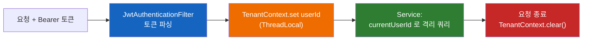

# 패턴 & 컨벤션 가이드

이 repo가 **반복해서 따르는 패턴**을 실제 코드로 설명한다. 새 도메인을 추가하거나 기존 코드를 고칠 때 이 문서의 패턴을 그대로 따르면 일관성이 유지된다.

> Kotlin 문법 자체가 낯설다면 먼저 [KOTLIN.md](KOTLIN.md)를 보고 오면 이 문서가 훨씬 잘 읽힌다.
> 개별 결정의 **배경·근거(왜)** 는 [conventions/](conventions/README.md)(ADR)에 기록한다 — 멀티테넌시 격리, 엔티티 Auditing·업데이트 컨벤션 등.

## 목차

1. [레이어 구조](#1-레이어-구조-controller--service--repository)
2. [멀티테넌시 (보안 1순위)](#2-멀티테넌시-보안-1순위-hard)
3. [DTO 경계](#3-dto-경계)
4. [검증](#4-검증)
5. [에러 처리](#5-에러-처리)
6. [서버 계산 SSOT](#6-서버-계산-ssot)
7. [트랜잭션](#7-트랜잭션)
8. [공통 상수·유틸](#8-공통-상수유틸)
9. [테스트](#9-테스트)
10. [🍳 새 도메인 추가 recipe](#10--새-도메인-추가-recipe)
11. [컨벤션 요약](#11-컨벤션-요약)

---

## 1. 레이어 구조 (controller → service → repository)

데이터는 한 방향으로만 흐른다. **레이어를 건너뛰지 않는다**(컨트롤러가 리포지토리를 직접 호출 ❌).

```
HTTP 요청
  │
  ▼
Controller   ── HTTP 관심사만: 라우팅, @Valid, 파라미터 정규화, 상태코드
  │             엔티티를 절대 다루지 않는다. DTO ↔ DTO.
  ▼
Service      ── 비즈니스 로직: 테넌트 격리, 계산(SSOT), 트랜잭션 경계, 엔티티↔DTO 변환
  │
  ▼
Repository   ── 데이터 접근만: Spring Data JPA 인터페이스. user_id 필터가 들어간 메서드.
  │
  ▼
PostgreSQL
```

각 레이어의 책임을 코드로 보면:

**Controller** — HTTP만. 비즈니스 로직 없음. ([`SaleController.kt`](../src/main/kotlin/kr/ai/flori/sales/controller/SaleController.kt))

```kotlin
@Tag(name = "Sales", description = "매출 관리")          // Swagger 그룹
@RestController
@RequestMapping("/sales")
class SaleController(
    private val saleService: SaleService,               // 생성자 주입 (KOTLIN.md §6)
) {
    @Operation(summary = "매출 생성", description = "수수료/입금예정일/입금상태는 서버가 계산")
    @PostMapping
    @ResponseStatus(HttpStatus.CREATED)
    fun create(
        @Valid @RequestBody request: SaleCreateRequest, // ← 경계에서 검증
    ): SaleResponse = saleService.create(request)       // ← 서비스에 위임, DTO 반환
}
```

> 컨트롤러가 하는 "정규화"의 예: `list`에서 `limit.coerceIn(1, 100)`으로 페이지 크기를 강제(과도한 limit 방어). 비즈니스 규칙이 아닌 HTTP 입력 위생이므로 컨트롤러에 둔다.

**Service** — 로직·격리·트랜잭션. ([`SaleService.kt`](../src/main/kotlin/kr/ai/flori/sales/service/SaleService.kt))

```kotlin
@Service
class SaleService(
    private val saleRepository: SaleRepository,
    private val customerRepository: CustomerRepository,
) {
    @Transactional
    fun create(request: SaleCreateRequest): SaleResponse {
        val userId = TenantContext.currentUserId()      // ← 테넌트 격리 (§2)
        request.customerId?.let { verifyCustomerOwnership(userId, it) }  // ← 소유권 검증
        val sale = Sale(userId = userId, /* ... */)
        return SaleResponse.from(saleRepository.save(sale))  // ← 엔티티→DTO
    }
}
```

**Repository** — 데이터 접근만. 인터페이스만 선언하면 Spring이 구현을 만든다. ([`SaleRepository.kt`](../src/main/kotlin/kr/ai/flori/sales/repository/SaleRepository.kt))

```kotlin
interface SaleRepository :
    JpaRepository<Sale, Long>,                 // 기본 CRUD 제공
    JpaSpecificationExecutor<Sale> {           // 동적 필터(Specification)
    fun findByIdAndUserId(id: Long, userId: Long): Sale?   // ← 메서드 이름이 곧 쿼리
}
```

**패키지 규칙**: 도메인별로 `kr.ai.flori.<domain>` 아래 `controller / service / repository / entity / dto` 하위 패키지를 둔다. 도메인에 속하지 않는 횡단 관심사(보안·에러·테넌트·S3·푸시·설정)는 `kr.ai.flori.common/`.

---

## 2. 멀티테넌시 (보안 1순위) [HARD]

> **RLS(행 수준 보안)가 없다. 애플리케이션이 유일한 방어선이다.** `user_id` 필터 한 줄을 빠뜨리면 곧 다른 사용자의 데이터가 유출된다. 이 패턴은 타협 불가다.

### 흐름



### 구성요소

**① 필터가 set/clear** — [`JwtAuthenticationFilter.kt`](../src/main/kotlin/kr/ai/flori/common/security/JwtAuthenticationFilter.kt). `finally`에서 반드시 `clear()` (스레드풀 재사용 시 이전 사용자 id 누수 방지):

```kotlin
try {
    resolveToken(request)?.let { token ->
        tokenProvider.parse(token)?.let { principal ->
            SecurityContextHolder.getContext().authentication = authentication
            TenantContext.set(principal.userId)   // ← 주입
        }
    }
    filterChain.doFilter(request, response)
} finally {
    TenantContext.clear()                          // ← 반드시 정리
}
```

**② TenantContext가 보관** — [`TenantContext.kt`](../src/main/kotlin/kr/ai/flori/common/tenant/TenantContext.kt). 인증이 없으면 안전한 기본값으로 **예외**를 던진다(빈 결과가 아니라 401):

```kotlin
object TenantContext {
    private val holder = ThreadLocal<Long?>()
    fun currentUserId(): Long = holder.get() ?: throw AppException(ErrorCode.UNAUTHORIZED)
}
```

**③ 서비스가 모든 쿼리에 적용** — 단건 조회는 `findByIdAndUserId`, 목록은 spec/쿼리에 `userId` 포함:

```kotlin
private fun load(id: Long): Sale =
    saleRepository.findByIdAndUserId(id, TenantContext.currentUserId())
        ?: throw AppException(ErrorCode.NOT_FOUND)   // 남의 것이면 "없음"으로 응답
```

### ✅ 해야 할 것 / ❌ 안티패턴

| ❌ 절대 금지 | ✅ 올바른 패턴 |
|---|---|
| `saleRepository.findById(id)` | `saleRepository.findByIdAndUserId(id, currentUserId())` |
| 외부에서 받은 `customerId`를 검증 없이 연결 | 연결 전 `findByIdAndUserId`로 **소유권 검증** |
| 다른 엔티티의 FK(예: `saleId`)를 그대로 신뢰 | 소유한 레코드인지 먼저 확인 (IDOR 방지) |
| 전역 unique 컬럼으로 `findByEndpoint(x)` | `findByUserIdAndEndpoint(userId, x)` |

> 소유권 검증의 실제 예: `SaleService.create`는 `request.customerId?.let { verifyCustomerOwnership(userId, it) }`로 **내 고객인지** 확인한 뒤에야 연결한다. 예약·사진의 `saleId`도 동일하게 `SaleService.get(id)`로 소유권을 통과시킨 뒤 연결한다.

---

## 3. DTO 경계

**엔티티는 컨트롤러 밖으로 나가지 않는다.** 요청과 응답 DTO는 분리한다. 한 도메인의 모든 DTO는 `<Domain>Dtos.kt` 한 파일에 모은다. ([`SaleDtos.kt`](../src/main/kotlin/kr/ai/flori/sales/dto/SaleDtos.kt))

```kotlin
// 요청: 검증 애너테이션을 붙인다. 서버 계산값(fee 등)은 받지 않는다.
data class SaleCreateRequest(
    @field:NotNull(message = "날짜는 필수입니다") val date: LocalDate?,
    @field:Min(value = 0, message = "금액은 0 이상이어야 합니다") val amount: Int?,
    val customerId: Long? = null,             // 선택 필드는 기본값으로
)

// 부분 수정: 모든 필드 nullable + 기본 null → "제공된 필드만 반영"
data class SaleUpdateRequest(
    val amount: Int? = null,
    val note: String? = null,
)

// 응답: 엔티티→DTO 변환은 companion object의 from()으로
data class SaleResponse(
    val id: Long,
    val fee: Int?,                            // 서버가 계산한 값
    /* ... */
) {
    companion object {
        fun from(sale: Sale): SaleResponse = SaleResponse(id = requireNotNull(sale.id), /* ... */)
    }
}
```

규칙:
- **요청 DTO**: 필수 필드도 타입은 nullable(`String?`)로 두고 `@field:NotNull/@field:NotBlank`로 검증한 뒤, 서비스에서 `requireNotNull`로 받는다. (왜 nullable인지는 [KOTLIN.md §검증](KOTLIN.md))
- **응답 DTO**: `companion object { fun from(entity) }` 한 곳에서만 변환. 컨트롤러에서 `list.map(SaleResponse::from)`처럼 메서드 참조로 쓴다.
- **서버 계산값은 요청에 포함하지 않는다**(앱이 보내도 무시) — 신뢰 경계.

---

## 4. 검증

**시스템 경계(컨트롤러 진입점)에서 검증한다.**

- 컨트롤러 파라미터에 `@Valid @RequestBody` → Bean Validation이 자동 수행, 실패 시 `MethodArgumentNotValidException` → `GlobalExceptionHandler`가 400으로 변환.
- `@PathVariable id: Long` — Long 타입이라 형식 불일치(숫자 아님)는 Spring이 자동 거부.
- 도메인 규칙(결제수단 화이트리스트 등)은 서비스에서 검증:

```kotlin
private fun requireValidPayment(value: String): String {
    if (value !in PaymentMethods.EXPENSE) throw AppException(ErrorCode.VALIDATION, "올바르지 않은 결제방식입니다")
    return value
}
```

---

## 5. 에러 처리

도메인 코드는 `AppException(ErrorCode.X)`만 던진다. HTTP 상태 매핑·응답 형식·Discord 알림은 전부 `@RestControllerAdvice` 한 곳에서 처리한다.

**ErrorCode** = (HTTP 상태 + 기본 메시지) 매핑 테이블. ([`ErrorCode.kt`](../src/main/kotlin/kr/ai/flori/common/error/ErrorCode.kt))

```kotlin
enum class ErrorCode(val status: HttpStatus, val defaultMessage: String) {
    VALIDATION(HttpStatus.BAD_REQUEST, "입력값이 올바르지 않습니다"),
    UNAUTHORIZED(HttpStatus.UNAUTHORIZED, "인증이 필요합니다"),
    NOT_FOUND(HttpStatus.NOT_FOUND, "대상을 찾을 수 없습니다"),
    /* ... */
}
```

**GlobalExceptionHandler** ([파일](../src/main/kotlin/kr/ai/flori/common/error/GlobalExceptionHandler.kt)):
- 예상된 예외(`AppException`, 검증 실패, 제약 위반) → 그대로 매핑, **Discord 전송 안 함**.
- 예기치 못한 예외(5xx) → **Discord 리포팅** + 일반 메시지로 교체 → 스택/쿼리 같은 내부 디테일을 클라이언트에 노출하지 않음.

```kotlin
@ExceptionHandler(Exception::class)
fun handleUnexpected(ex: Exception, request: WebRequest): ResponseEntity<ErrorResponse> {
    reporter.report(ex, mapOf("action" to request.getDescription(false)))  // Discord에만 상세
    return errorResponse(ErrorCode.INTERNAL, null)                          // 클라엔 일반 메시지
}
```

> 새 에러 유형이 필요하면 `ErrorCode`에 항목 하나 추가하면 끝. 핸들러는 건드릴 일이 거의 없다.

---

## 6. 서버 계산 SSOT

금액·날짜 계산은 **서버가 단일 진실 공급원(SSOT)**. 앱은 표시만 한다. 계산 로직은 서비스 본체가 아니라 **전용 계산기/순수 함수**로 분리해 단위 테스트한다.

- 지출총액: `unit_price * quantity`
- 고정비 발생 판정: 주/월/연·격주·말일 클램핑 — `RecurringScheduleEvaluator`(순수 로직)가 `RecurringExpenseGenerator`에서 분리

예: `RecurringScheduleEvaluator`(발생 판정 순수 함수)와 `RecurringExpenseGenerator`(@Scheduled 진입점)가 역할을 나눈다. 서비스는 "언제 생성할지", 계산기는 "어떻게 판정할지"를 담당.

```kotlin
class RecurringExpenseGenerator(
    private val evaluator: RecurringScheduleEvaluator,  // 협력자로 주입
) {
    fun generateForDate(date: LocalDate) { /* evaluator.shouldGenerate() 호출 */ }
}
```

---

## 7. 트랜잭션

- **읽기**: `@Transactional(readOnly = true)` — 성능 힌트 + 실수로 쓰기 방지.
- **쓰기**: `@Transactional`.
- ⚠️ **JDBC로 쓰는 메서드는 readOnly면 안 된다.** (예전에 `sendDailySummary`가 `readOnly`로 토큰 비활성 UPDATE를 하던 버그가 있었다 → read-write로 수정.) `@Scheduled`로 도는 메서드도 쓰기면 `@Transactional`(readOnly 아님)이어야 한다.
- ⚠️ Kotlin은 `kotlin-spring` 플러그인이 `@Service`/`@Component`를 자동 `open` 처리하지만 **abstract 베이스 클래스는 안 연다** → 추상 클래스의 `@Transactional` 메서드는 명시적으로 `open`이어야 CGLIB 프록시가 동작한다. (자세히는 [KOTLIN.md §Spring 주의](KOTLIN.md))

---

## 8. 공통 상수·유틸

도메인 간 중복되는 상수/계산은 `common/`으로 끌어올린다. 매직 문자열 산재 = 버그/유출의 원천.

| 위치 | 내용 |
|---|---|
| [`common/domain/PaymentMethods.kt`](../src/main/kotlin/kr/ai/flori/common/domain/PaymentMethods.kt) | `PaymentMethods.SALE/EXPENSE/UNPAID` |
| [`common/domain/ReservationStatuses.kt`](../src/main/kotlin/kr/ai/flori/common/domain/ReservationStatuses.kt) | `ReservationStatuses.PENDING/CONFIRMED/COMPLETED/CANCELLED` + `ALL` |
| [`common/util/DateRanges.kt`](../src/main/kotlin/kr/ai/flori/common/util/DateRanges.kt) | `KST`(=`ZoneId.of("Asia/Seoul")`), `monthRange(month)` (YYYY/YYYY-MM/YYYY-MM-DD → 시작·끝 날짜, 잘못된 형식은 400 VALIDATION) |

> 도메인 상태/수단 문자열은 새로 만들지 말고 `common/domain`의 상수를 쓴다. 새 상태군이 생기면 같은 패턴으로 `common/domain`에 추가한다(예: `ReservationStatuses`).

```kotlin
// ❌ 도메인마다 흩어진 매직값
if (value !in setOf("card", "cash", "transfer", "unpaid")) ...
private val KST = ZoneId.of("Asia/Seoul")

// ✅ 공통 상수/유틸 재사용
if (value !in PaymentMethods.SALE) ...
val today = LocalDate.now(KST)
```

---

## 9. 테스트

- 통합 테스트는 **Zonky 임베디드 PostgreSQL**에서 실제 Flyway 마이그레이션·쿼리를 돈다(H2 같은 가짜 DB가 아님). 클래스에 `@AutoConfigureEmbeddedDatabase(provider = ZONKY)`.
- **모든 도메인에 멀티테넌시 격리 테스트 필수** — "다른 user의 데이터를 조회/수정할 수 없다"를 검증.
- 계산·규칙(영업일, 고정비 발생 판정, 수수료)은 **순수 함수 단위 테스트**로 빠르게 검증.
- 검증 게이트: `./gradlew build test`가 ktlint + detekt + 전체 테스트 + **JaCoCo line 80% 커버리지**를 한 번에 돌린다. **통과해야만 커밋.** (현재 89%)

### 9-1. API 문서 = 테스트 (RestDocs → OpenAPI → Swagger) [HARD]

Swagger 문서는 **컨트롤러 어노테이션이 아니라 테스트가 출처(SSOT)** 다. springdoc 컨트롤러 스캔은 `packages-to-scan: kr.ai.flori.__docs_from_restdocs_only__`(더미 패키지)로 억제하고, `OpenApiConfig` 빈이 RestDocs 생성 정적 스펙(`static/docs/open-api-3.0.1.json`)을 읽어 JWT bearerAuth 보안 스킴과 합쳐 `/v3/api-docs`로 노출 → swagger-ui가 병합본을 표시(Authorize 버튼). 컨트롤러에 `@Operation`/`@Schema`를 다는 게 아니라 **`*DocsTest`를 쓴다.**

- 베이스: `src/test/.../common/docs/RestDocsSupport.kt`(`@AutoConfigureRestDocs` + Zonky). `mockMvc`·`signupAndToken()`(JWT)·`docs(...)` 헬퍼 제공.
- 엔드포인트마다 실제 호출 + `andDo { handle(docs(...)) }`로 request/response 필드를 기술. 모든 JSON 필드는 `fieldWithPath`로 1:1 기술해야 하며(누락 시 RestDocs 실패), nullable은 `.optional()`.
```kotlin
class CouponDocsTest : RestDocsSupport() {
    @Test fun `쿠폰 생성 문서화`() {
        val token = signupAndToken()
        mockMvc.post("/coupons") {
            header(HttpHeaders.AUTHORIZATION, "Bearer $token")
            contentType = MediaType.APPLICATION_JSON
            content = json(mapOf("code" to "WELCOME"))
        }.andExpect { status { isCreated() } }
            .andDo { handle(docs(
                identifier = "coupon-create", tag = "Coupons", summary = "쿠폰 생성",
                requestFields = listOf(fieldWithPath("code").type(JsonFieldType.STRING).description("쿠폰 코드")),
                responseFields = listOf(fieldWithPath("id").type(JsonFieldType.NUMBER).description("쿠폰 ID")),
            )) }
    }
}
```
- 스펙 갱신: `./gradlew openapi3`(테스트 후 집계 → `static/docs/open-api-3.0.1.json` 재생성, 커밋). PR에서 API 계약 변경이 diff로 보인다.
- 빈 배열 응답은 `fieldWithPath` 매칭 실패를 유발 → 문서화 전에 데이터를 시드하거나 항목 필드를 `.optional()`.

---

## 10. 🍳 새 도메인 추가 recipe

목표: **기존 코드를 수정하지 않고 패키지 추가만으로** 새 도메인을 붙인다. 예로 `coupons` 도메인을 추가한다고 하자.

**0. (스키마가 새로 필요하면) Flyway 마이그레이션 추가**
`src/main/resources/db/migration/V{다음번호}__add_coupons.sql` 생성. 기존 V 파일은 절대 수정하지 않는다(불변). PK는 `id bigint generated by default as identity`, `user_id bigint not null references users(id) on delete cascade` 컬럼 필수.

**1. 엔티티** — `coupons/entity/Coupon.kt`. 생성/수정 시각은 `BaseEntity`를 상속해 자동 관리(직접 선언·갱신 ❌).
```kotlin
@Entity @Table(name = "coupons")
class Coupon(
    @Column(name = "user_id", nullable = false) var userId: Long,
    @Column(name = "code", nullable = false) var code: String,
) : BaseEntity() {              // created_at/updated_at 자동 — common/entity/BaseEntity.kt
    @Id @GeneratedValue(strategy = GenerationType.IDENTITY) var id: Long? = null
}
```
> `data class`가 아니라 `class` + `var`를 쓰는 이유는 [KOTLIN.md §엔티티](KOTLIN.md) 참고.
> 생성 시각만 필요한 append-only/이력 엔티티는 `BaseCreatedEntity`를 상속한다. `updated_at`이 없거나(예: `UserPreferences`) 타임스탬프가 아예 없는 엔티티만 베이스를 쓰지 않는다.
> **다중 필드 상태 전이**(예: 미수 완료 = `is_unpaid=false` + 결제수단 교체 동시 변경)는 서비스가 흩뿌리지 말고 엔티티 도메인 메서드(`sale.completeUnpaid(paymentMethod)`)로 캡슐화한다.

**2. 리포지토리** — `coupons/repository/CouponRepository.kt`. **반드시 `...AndUserId` 메서드로** 격리.
```kotlin
interface CouponRepository : JpaRepository<Coupon, Long> {
    fun findByIdAndUserId(id: Long, userId: Long): Coupon?
    fun findByUserIdOrderByCreatedAtDesc(userId: Long): List<Coupon>
}
```

**3. DTO** — `coupons/dto/CouponDtos.kt`. 요청(검증)·응답(`from`) 분리.

**4. 서비스** — `coupons/service/CouponService.kt`. `@Service`, 생성자 주입, 모든 쿼리에 `TenantContext.currentUserId()`.
```kotlin
@Service
class CouponService(private val couponRepository: CouponRepository) {
    @Transactional(readOnly = true)
    fun list(): List<CouponResponse> =
        couponRepository.findByUserIdOrderByCreatedAtDesc(TenantContext.currentUserId())
            .map(CouponResponse::from)
}
```

**5. 컨트롤러** — `coupons/controller/CouponController.kt`. `@RestController`, `@RequestMapping("/coupons")`, `@Tag`, `@Operation`, `@Valid`.

**6. 보안 경로** — 기본적으로 `SecurityConfig`가 인증 필요로 막으므로 **공개 엔드포인트가 아니면 건드릴 것 없음**. 공개가 필요할 때만 permitAll 화이트리스트에 추가.

**7. 테스트** — `src/test/.../coupons/`에 통합 테스트(격리 테스트 포함).

**8. 게이트** — `./gradlew build test` → 통과 → 변경 파일만 커밋.

> 이 8단계 어디에서도 **다른 도메인 파일을 수정하지 않는다**. 그것이 "확장성" 원칙(CLAUDE.md)의 실현이다.

---

## 11. 컨벤션 요약

| 항목 | 규칙 |
|------|------|
| 패키지 | `kr.ai.flori.<domain>.{controller,service,repository,entity,dto}`; 횡단은 `common/` |
| 네이밍 | 컨트롤러 `XController`, 서비스 `XService`, 리포 `XRepository`, DTO `XRequest`/`XResponse` |
| DTO 파일 | 도메인당 `XDtos.kt` 하나에 모음 |
| 엔티티 | `class`(not data class) + `var`, `@Id`는 nullable `Long? = null`(IDENTITY) |
| 격리 | 모든 쿼리 `...AndUserId`; 단건은 `findByIdAndUserId` |
| 검증 | 경계에서 `@Valid`; 요청 필드 nullable + `@field:NotNull` |
| 에러 | `AppException(ErrorCode.X)`만 던짐; 매핑은 핸들러가 |
| 트랜잭션 | 읽기 `readOnly=true`, 쓰기 `@Transactional`(JDBC 쓰기는 readOnly 금지) |
| 시간 | 항상 `KST` 상수 사용(`LocalDate.now(KST)`) |
| 커밋 | conventional(한국어), 변경 파일만 명시 추가, 게이트 통과 후 |
