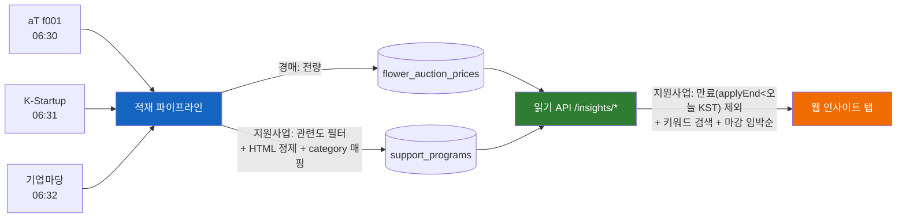

# 인사이트 적재 플로우 (경매시세 · 지원사업)

> 인사이트(`/insights`) 탭에 노출되는 공유 데이터를 외부 공공 API에서 어떤 소스·시간·필터·분류로 수집·적재하는지 정리한다.
> 코드: `kr.ai.flori.insights`. 인사이트는 **경매시세 + 지원사업 2탭**(트렌드 탭은 2026-06-24 제거).

## 한눈에

| 탭 | 적재기(@Scheduled) | 소스 / 발급처 | cron(KST) | env 키 |
|----|----|----|----|----|
| 경매시세 | `FlowerAuctionIngestService` | aT 화훼유통정보 **f001**(단일시장=양재) | **06:30** | `FLOWER_API_SERVICE_KEY` |
| 지원사업 | `SupportProgramIngestService` | 창업진흥원 **K-Startup**(공공데이터포털 data.go.kr) | **06:31** | `KSTARTUP_API_SERVICE_KEY` |
| 지원사업 | `BizinfoIngestService` | **기업마당 bizinfo**(소진공·지자체·중기부 통합) | **06:32** | `BIZINFO_API_CRTFC_KEY` |

- 적재는 모두 **Spring `@Scheduled`**(KST). **키 미설정 시 no-op**(경고 로그만, 키 없는 dev 부팅 가능).
- **스케줄러는 단일 스레드**(`common/config/ScheduleConfig` = `@EnableScheduling`만, 풀 1). 같은/근접 시각이어도 **순차 실행** → 06:30→06:31→06:32 순서 보장(1분 간격은 명목상, 앞 배치 끝나면 다음).
- cron·페이지 등은 전부 env로 덮을 수 있다(`*_API_CRON`, `*_API_PAGES` 등).



## 1) 경매시세 — `FlowerAuctionIngestService`
- **소스/API**: aT 화훼유통정보 `f001` — `flower.at.or.kr/api/returnData.api?kind=f001&dataType=json`. 시장 구분 없는 단일 시장(양재) 응답.
- **조회**: 최근 `backfillDays`(기본 3일) × 4개 화훼구분(절화1/관엽2/난3/춘란4) 전 페이지(countPerPage=1000). 정산 지연/누락일 커버.
- **필터/분류**: 없음(전량). flowerGubn 텍스트 그대로(절화/관엽/난/춘란).
- **적재**: `flower_auction_prices` · UPSERT `ON CONFLICT (sale_date, flower_gubn, pum_name, good_name, lv_nm) DO UPDATE`(정산 정정 반영, 멱등). 응답 금액은 STRING → 숫자 파싱.

## 2) 지원사업 K-Startup — `SupportProgramIngestService`
- **소스/API**: 창업진흥원 K-Startup 사업공고 `getAnnouncementInformation01`(data.go.kr, `ServiceKey`, `returnType=json`). 인증키 파라미터명은 대문자 `ServiceKey`.
- **조회**: `pages`(기본 **10**) × `perPage`(100), 최신순. 빈 페이지면 중단. (관련도 필터로 적재량이 줄어 페이지를 넉넉히 잡음)
- **필터**: ① `pbanc_sn`·공고명 없으면 skip ② **`GrantRelevance.isRelevant(제목, pbancCtnt, aplyTrgtCtnt)`** 미통과 skip.
- **분류**: `mapCategory(supt_biz_clsfc)` → 자금·사업화·기술개발·R&D=**fund** / 마케팅·판로·해외진출=**marketing** / 교육·멘토·컨설팅=**education** / 그 외=null.
- **정제**: `HtmlText.clean()` → target(aplyTrgtCtnt)·summary(pbancCtnt).
- **적재**: `support_programs` **source='k-startup'** · UPSERT `ON CONFLICT (source, source_id) DO UPDATE`. source_id=pbanc_sn. 날짜 yyyyMMdd → apply_start/end.

## 3) 지원사업 기업마당 — `BizinfoIngestService`
- **소스/API**: 기업마당 `bizinfoApi.do` — `bizinfo.go.kr/uss/rss/bizinfoApi.do?crtfcKey=&dataType=json&pageUnit=&pageIndex=`(hashtags 옵션). 소진공·지자체·중기부 공고를 통합한 **단일 소스**(소진공 단독 공고 API는 없음).
- **인증 주의**: `crtfcKey`는 **기업마당 "정책정보 개방"에서 발급**(data.go.kr 아님). 발급 시 **시스템 IP(또는 URL) 등록 필수 → 키가 호출 IP에 바인딩됨.** dev 배포 시 dev egress IP로 (재)발급 필요.
- **조회**: `pages`(기본 **10**) × `pageUnit`(100). 응답 봉투 `{"jsonArray":[...]}`. 빈 배열이면 중단.
- **필터**: ① pblancId·공고명 없으면 skip ② **`GrantRelevance.isRelevant(제목, bsnsSumryCn, trgetNm)`** 미통과 skip.
- **분류**: `mapCategory(pldirSportRealmLclasCodeNm)` → 금융·자금·기술·R&D=fund / 수출·내수·판로·마케팅·해외=marketing / 창업·경영·인력·교육·컨설팅·멘토=education / 그 외=null. *(8개 분야→3개 카테고리 압축이라 거칠다 — 5개 확장은 보류)*
- **정제/가공**: `HtmlText.clean()` → summary(bsnsSumryCn). pblancUrl 상대경로 → 절대 URL. reqstBeginEndDe `"YYYYMMDD ~ YYYYMMDD"` split → apply_start/end(상시/공백 null).
- **적재**: `support_programs` **source='bizinfo'** · 동일 UPSERT. source_id=pblancId.

## 공유 컴포넌트
- **`GrantRelevance`**(지원사업 2종 공통 관련도 필터): 제목·요약·지원대상 중 하나라도 키워드 부분일치 시 통과.
  - 소상공인: `소상공인·소공인·자영업·골목상권·전통시장·상점가·백년가게·점포·생활밀착·1인기업`
  - 화훼: `화훼·플로리스트·꽃집·꽃도매`
  - ⚠️ 짧은 단어 오탐 제외: `원예`(→"지**원예**산"), `화원`(→"문**화원**").
  - **왜 필요한가**: 두 포털 모두 전국·전분야 공고를 통째로 줌. 꽃 전용은 0건, 소상공인 공통이 ~수% 수준 → 필터 없으면 스타트업·제조·R&D 노이즈에 묻힘.
- **`HtmlText.clean()`**: 태그 제거(→공백) + 엔티티 복원(`&nbsp;&amp;&lt;…`) + 공백 정규화. 정제 후 빈 문자열은 null.
- **중복**: `support_programs UNIQUE(source, source_id)` → 소스 내 멱등. **소스 간 중복은 허용**(동일 공고가 양쪽에 뜰 수 있으나 실측 0건 — 제목이 안 겹침).
- **분류 CHECK**: `support_programs.category IN ('fund','marketing','education')`(+null).

## 읽기 → 노출
- `GET /insights/auction*` (화훼구분·날짜·강세/약세·드릴다운), `GET /insights/grants?category=&keyword=&offset=&limit=`.
- **지원사업 목록 필터**: 만료(`applyEnd < 오늘`) 제외 + 카테고리 + 제목·요약·기관 키워드 검색 + **마감 임박순(nulls last)**.
  - **기준일은 KST**: 서버가 `LocalDate.now(KST)`로 계산한 `today`를 쿼리에 넘긴다(`applyEnd >= :today`). Postgres `CURRENT_DATE`(UTC)를 쓰면 KST 새벽(00~09시)에 어제 마감 공고가 안 걸러지는 TZ 버그가 생겨 제거함.
- **dDay 배지**(웹): `applyEnd - today(KST)` → `상시`(null) / `마감`(<0, 회색) / `마감 D-DAY`(0, 빨강) / `마감 D-N`(임박 빨강·노랑·회색).
- **스크랩(개인)**: `insight_scraps(user_id, target_type='grant', target_id)` + `flower_item_scraps`(경매 품목). **스크랩 목록은 만료 필터 없음**(찜한 건 만료돼도 보존).

## env (요약)
```
FLOWER_API_SERVICE_KEY      # aT 경매 (미설정 시 no-op)
KSTARTUP_API_SERVICE_KEY    # K-Startup (data.go.kr 일반인증키, IP등록 불필요)
BIZINFO_API_CRTFC_KEY       # 기업마당 (IP 바인딩 — dev EC2 IP 등록 필요)
*_API_CRON / *_API_PAGES …  # cron·페이지 등 전부 env 오버라이드 가능
```

## 보류/후속
- 5개 카테고리 확장(자금/창업/경영/판로/교육) + 출처(K-Startup/기업마당) 필터칩 — 보류.
- 꽃 행사/박람회 피드(TourAPI) — B2B 가치 애매로 보류.
- `GrantRelevance.KEYWORDS`·bizinfo `searchLclasId`/`hashtags` 튜닝.
